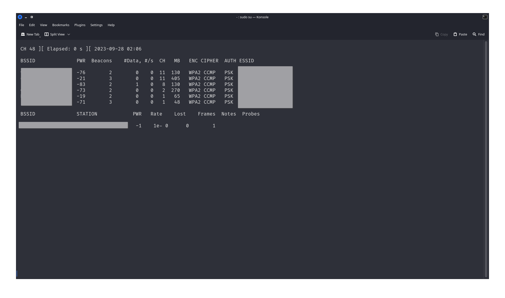

# WiPi
Automatic WPA/WPA2 Handshake Catcher

Prerequirments :

- Aircrack-ng : `sudo apt install aircrack-ng`
- Pip Librarys: 'pip3 install -r requirements.txt'

Open terminal.....

#### Terminal:
Prerequirments :

- Execute : `python3 Wipi.py`

